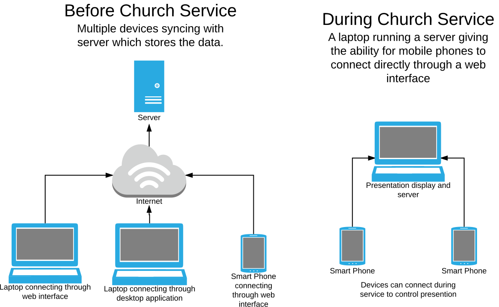

# WorshipUp

## General idea
Mostly copy OpenSong in organization abilities, but have a central server so that multiple people can work on the worship service throughout the week.

## Application Features
* Make set lists for the week
  * Ability to choose songs already in the database or to add new songs
* Edit songs
* Print songs for set list
* Present song slides (maybe for musicians as well with an iPad or iPhone)


## To-do
- [ ] Finalize format for transmitting song data
- [ ] Implement method for floating chords above the lyrics they go with
- [ ] Style the page
- [ ] Make song printable, and preferably not in need of additional formatting. It should print on a second column if the second column overflows
- [ ] Make the presentation feature
- [ ] Implement accounts and authorization
- [ ] Make way to edit songs
- [ ] Create way to make set lists for upcoming services
- [ ] Implement remote control app for phones


## Installation
A few prerequisites. Recommended to use [Homebrew](https://brew.sh/).

Install Yarn (and thus Node.js)
```bash
brew install yarn
```

Install Go
```bash
brew install go
```

Go get this repo
```bash
go get github.com/andygarfield/worshipup
```

Navigate to the repo directory
```bash
cd ~/go/src/github.com/andygarfield/worshipup
```

Install node packages
```bash
yarn install
```

## Running
To run the application
```bash
yarn run test
```

Then go to http://localhost:8080


## Configurations
People who are setting up the system can choose from a few different configurations. These are ordered by simplest to most complex.

1. A basic single-system setup where the data is stored and presented locally. The client and server are implimented on the same machine.
2. A client and a server implementation on separate machines. The server has the master copy of the data and the client syncs with it. The desktop client presents with a current copy of the data. Also have a web interface that has all the capabilities of the desktop application.
3. Same as #2 but with devices set up to connect to a client server and control the presentation and potentially make changes mid-presentation. Would like to do this over wi-fi direct or bluetooth.

The desire is to have the ability to smoothly upgrade to a more complicated configuration if a church's needs grow.

## General Architechture


[source](https://www.lucidchart.com/invitations/accept/c311a15e-7224-4a86-ba2f-b82a73967ef2)

